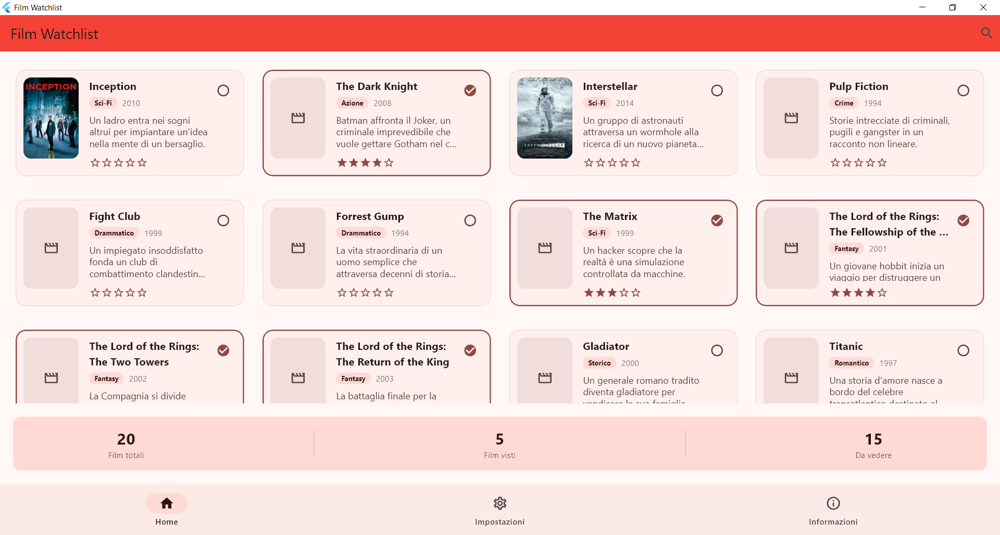
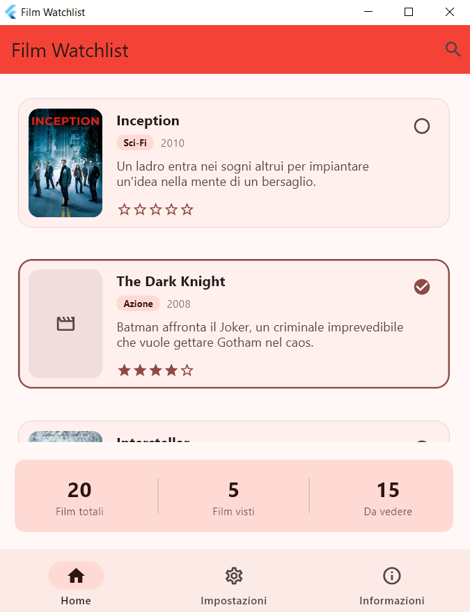
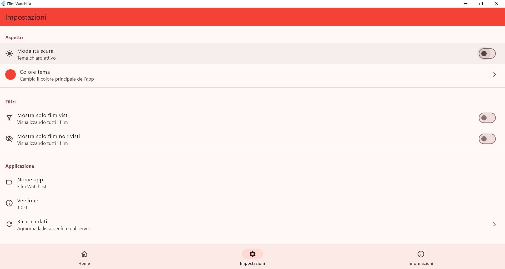
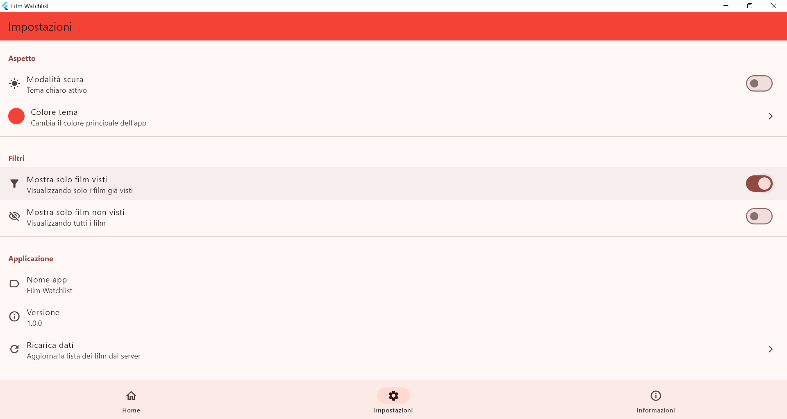
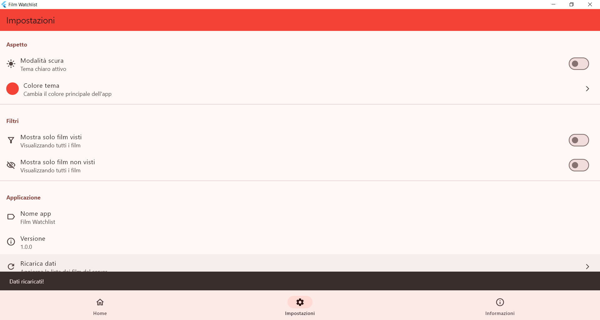
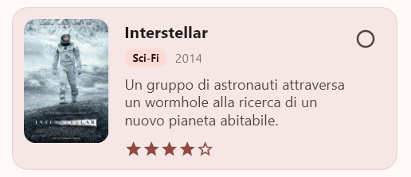
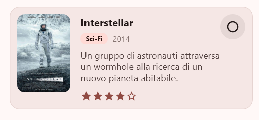
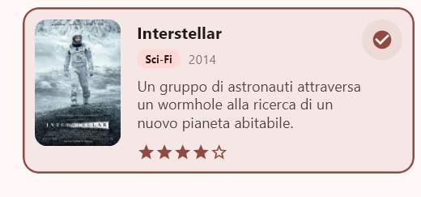

# Film Watchlist

## A. Informazioni Studente
**Nome:** Elia Lini  
**Numero di Matricola:** 344397

## B. Titolo del Progetto
**Film Watchlist** - Applicazione mobile multipiattaforma basata su Flutter per la gestione di liste personali di film da guardare

## C. Panoramica del Progetto
Film Watchlist è un'applicazione mobile multipiattaforma che consente agli utenti di gestire la propria collezione personale di film da guardare. L'app scarica una lista curata di film da una sorgente JSON remota e permette agli utenti di segnare i film come visti o non visti, valutarli con un sistema a 5 stelle e filtrare la collezione in base allo stato di visualizzazione. Gli utenti possono cercare film per titolo, genere o descrizione, e personalizzare l'aspetto dell'app con la selezione del colore del tema e il passaggio tra modalità chiara/scura. L'applicazione presenta un design responsive che si adatta tra layout a lista e griglia in base alle dimensioni dello schermo, fornendo un'esperienza di visualizzazione ottimale su diversi dispositivi. La persistenza locale garantisce che le preferenze dell'utente e lo stato di visualizzazione siano mantenuti tra le diverse sessioni dell'app.

## D. Panoramica dell'Esperienza Utente

### Principali Azioni Utente

1. **Visualizzazione della Collezione di Film**
   - All'avvio dell'app, gli utenti vedono la home page principale che mostra tutti i film disponibili
   - I film sono presentati in un layout responsive: vista a griglia su schermi più grandi, vista a lista su dispositivi più piccoli
   - Ogni card di film mostra l'immagine del poster, titolo, anno, genere, valutazione e un indicatore visivo dello stato di visualizzazione

2. **Segnare Film come Visti/Non Visti**
   - Gli utenti possono toccare direttamente la card di un film o attivare la checkbox sul lato destro per segnare un film come visto
   - I film visti mostrano un bordo colorato distintivo e una checkbox riempita
   - Il cambiamento si riflette immediatamente nell'interfaccia e viene salvato localmente

3. **Valutare i Film**
   - Gli utenti possono toccare l'icona della stella su qualsiasi card di film per aprire un dialogo di valutazione
   - Un sistema di valutazione a 5 stelle permette agli utenti di valutare i film da 1 a 5 stelle
   - Le valutazioni sono visualizzate sulla card del film e memorizzate in modo persistente

4. **Ricerca di Film**
   - Toccando l'icona di ricerca nella barra dell'app si attiva la modalità di ricerca
   - Gli utenti possono cercare film per titolo, genere o descrizione in tempo reale
   - La lista dei film viene filtrata dinamicamente mentre l'utente digita

5. **Filtraggio della Collezione**
   - Nella pagina Impostazioni, gli utenti possono attivare filtri per mostrare solo i film visti o solo quelli non visti
   - Questi filtri funzionano in combinazione con la funzione di ricerca

6. **Personalizzazione dell'Aspetto**
   - Gli utenti possono passare tra i temi scuro e chiaro usando un toggle nelle Impostazioni
   - Il colore del tema può essere randomizzato toccando "Colore tema" nelle Impostazioni
   - Le preferenze del tema vengono mantenute tra le diverse sessioni dell'app

7. **Visualizzazione delle Statistiche**
   - La pagina Informazioni mostra statistiche sulla watchlist (totale film, numero visti, numero non visti)
   - Gli utenti possono vedere le funzionalità dell'app e informazioni sulla versione

### Screenshot

> 1. La home page principale con la vista a griglia/lista dei film




> 2. La pagina delle impostazioni con le opzioni del tema e i filtri





> 3. Una card di film che mostra la funzionalità di valutazione o la pagina informazioni con le statistiche






## E. Tecnologia

### Pacchetti Dart/Flutter Utilizzati

1. **flutter_riverpod / riverpod (v3.0.3)**
   - **Perché:** Scelto per la gestione dello stato grazie al suo approccio type-safe e alle eccellenti prestazioni
   - **Come:** Utilizzato estensivamente in tutta l'app per gestire:
     - Lo stato della lista dei film
     - Le preferenze dell'utente (filtri, query di ricerca)
     - Lo stato del tema
     - Lo stato di visualizzazione e le valutazioni
   - Il `StateNotifierProvider` di Riverpod permette aggiornamenti reattivi dell'UI quando i dati cambiano, e `FutureProvider` gestisce il caricamento asincrono dei dati

2. **http (v1.6.0)**
   - **Perché:** Per scaricare i dati dei film da una sorgente JSON remota
   - **Come:** Utilizzato nell'`onlineFilmProvider` per scaricare i dati dei film da GitHub
   - I film vengono caricati da: `https://raw.githubusercontent.com/Elial123/repo/refs/heads/main/db.json`

3. **uuid (v4.5.2)**
   - **Perché:** Per generare identificatori univoci e deterministici per i film
   - **Come:** Utilizza UUID v5 (basato su namespace) per creare ID consistenti basati su titolo e anno del film
   - Questo garantisce che lo stesso film abbia sempre lo stesso ID, permettendo una corretta sincronizzazione tra dati online e locali

4. **path_provider (v2.1.5)**
   - **Perché:** Per accedere a directory specifiche della piattaforma per lo storage di file
   - **Come:** Utilizzato per memorizzare i dati dei film in cache nella directory temporanea
   - Abilita la funzionalità offline tramite il caching della lista dei film scaricata

5. **shared_preferences (v2.3.5)**
   - **Perché:** Per persistere le preferenze dell'utente e gli stati dei film localmente
   - **Come:** Memorizza:
     - Preferenze del tema (modalità scura, colore del tema)
     - Stato di visualizzazione dei film e valutazioni
     - Preferenze dei filtri dell'utente (visto o non visto)
   - I dati persistono tra le diverse sessioni dell'app

6. **path (v1.9.1)**
   - **Perché:** Manipolazione dei percorsi indipendente dalla piattaforma
   - **Come:** Utilizzato insieme a path_provider per costruire percorsi di file per il caching

### Scelte Implementative

#### 1. **Strategia di Caching con Scadenza di 1 Ora**
L'app implementa un meccanismo di caching intelligente che memorizza i dati dei film scaricati in un file locale (`films.json` nella directory temporanea). La cache scade dopo 1 ora, bilanciando sia la freschezza dei dati che l'efficienza di rete. Sulla piattaforma web, il caching viene saltato per via delle limitazioni del browser, e i dati vengono sempre scaricati dalla rete.

```dart
// Estratto da providers.dart
const cacheExpirationDuration = Duration(hours: 1);
```

#### 2. **Generazione Deterministica di UUID**
Invece di generare UUID casuali, l'app utilizza UUID v5 con un namespace per creare ID deterministici basati su titolo e anno del film. Questo garantisce che quando la lista dei film viene aggiornata dal server, i film esistenti mantengano i loro ID, preservando lo stato di visualizzazione e le valutazioni impostate dall'utente.

```dart
// Estratto dal file film.dart
final id = uuid.v5(Uuid.NAMESPACE_URL, '$titolo-$anno');
```

#### 3. **Layout Responsive**
L'app utilizza `LayoutBuilder` per rilevare la larghezza dello schermo e passa automaticamente tra layout a griglia e lista:
- Vista a griglia per schermi più larghi di 600px, con numero di colonne dinamico basato sulla larghezza disponibile (ogni colonna ha una larghezza minima di 320px)
- Vista a lista per schermi più stretti di 600px

Questo fornisce un'esperienza di visualizzazione ottimale su telefoni, tablet e schermi desktop, adattando automaticamente il numero di colonne alla dimensione dello schermo.

#### 4. **Sincronizzazione dello Stato**
L'app implementa una sincronizzazione intelligente tra i dati online e lo stato locale. Quando vengono scaricati nuovi film dal server (tramite cache o dopo un ricaricamento manuale dalla pagina Impostazioni), l'app unisce i dati aggiornati con lo stato di visualizzazione e le valutazioni memorizzate localmente. Utilizzando `WidgetsBinding.instance.addPostFrameCallback` nella home page, la sincronizzazione avviene dopo il rendering, garantendo che gli utenti non perdano mai i loro progressi pur ricevendo film aggiornati dal server.

#### 5. **Esecuzione Platform-Aware**
Utilizzando la costante `kIsWeb` di Flutter, l'app comprende se è in esecuzione su piattaforme web o native e adatta di conseguenza il comportamento di caching.

### Archiviazione Dati

L'applicazione memorizza i dati in due modi:

1. **Cache Temporanea (Solo Piattaforme Native)**
   - I dati dei film scaricati dal server remoto vengono salvati in cache nella directory temporanea del dispositivo
   - File di cache: `films.json`
   - Scadenza: 1 ora
   - Scopo: Riduce le richieste di rete e abilita la visualizzazione offline

2. **Archiviazione Persistente (Tutte le Piattaforme)**
   - Preferenze dell'utente memorizzate tramite `shared_preferences`
   - Include: impostazioni del tema, stati dei filtri, stato di visualizzazione, valutazioni
   - Persiste indefinitamente finché non viene cancellato manualmente dall'utente

### Comunicazione Remota

L'app comunica con un server remoto ospitato su GitHub:
- **URL:** `https://raw.githubusercontent.com/Elial123/repo/refs/heads/main/db.json`
- **Metodo:** Richiesta HTTP GET
- **Formato Dati:** JSON
- **Scopo:** Scaricare la lista iniziale dei film con titoli, anni, generi, descrizioni e URL dei poster

### Problemi Riscontrati e Soluzioni

#### Problema 1: Perdita di Stato al Refresh dei Dati
**Problema:** Inizialmente, quando l'app scaricava dati aggiornati dal server, tutti gli stati di visualizzazione e le valutazioni impostate dall'utente venivano persi perché la lista dei film veniva completamente sostituita.

**Soluzione:** Implementato un meccanismo di sincronizzazione dello stato che unisce i dati dei film online con lo stato di visualizzazione e le valutazioni memorizzate localmente. Utilizzata la generazione deterministica di UUID per garantire che i film mantengano ID consistenti tra i refresh.

#### Problema 2: Colore del Tema Non Applicato all'AppBar
**Problema:** Il colore del tema personalizzato non veniva applicato in modo consistente all'AppBar su tutte le pagine.

**Soluzione:** Impostati correttamente sia `backgroundColor` che `surfaceTintColor` nella configurazione `AppBarTheme` all'interno della definizione `ThemeData` in `main.dart`.


---

## Esecuzione del Progetto

1. Assicurarsi che Flutter SDK sia installato (versione 3.9.2 o superiore)
2. Clonare il repository
3. Eseguire `flutter pub get` per installare le dipendenze
4. Eseguire `flutter run` per avviare l'app sulla piattaforma desiderata 

---

**Versione:** 0.1.0  
**Ultimo Aggiornamento:** Febbraio 2026
